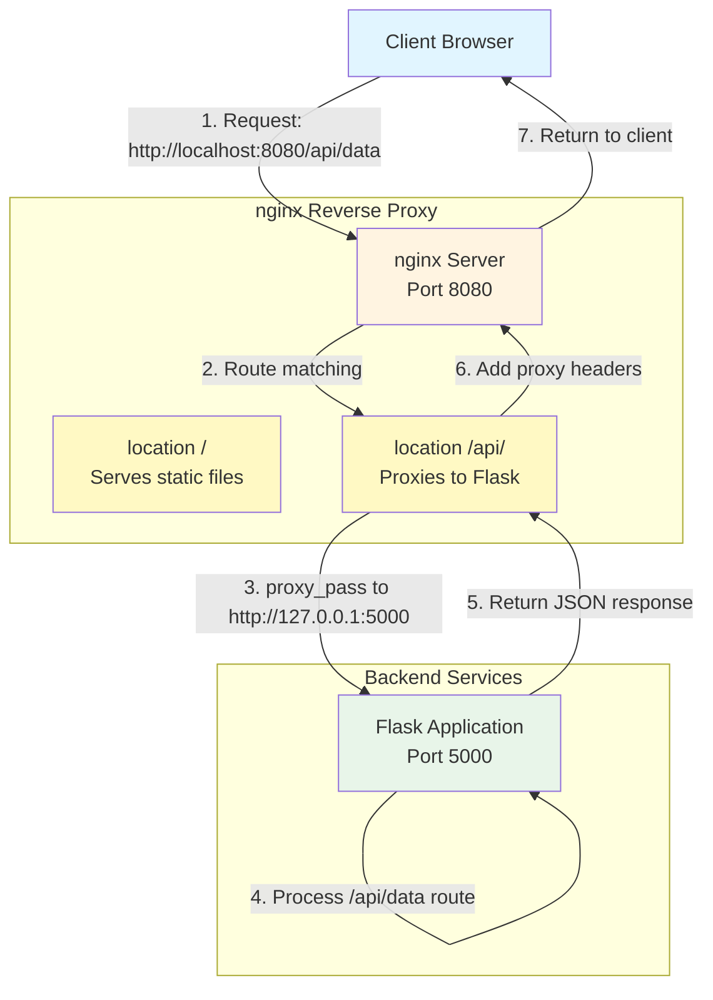

# Topic 2: nginx as Reverse Proxy

This section demonstrates how to configure nginx as a reverse proxy to forward requests to a backend application.

## Learning Objectives

- Understand reverse proxy concept
- Configure nginx to proxy requests to backend services
- Set up a Python Flask application as backend
- Handle different URL paths and routing

## Prerequisites

- Python 3.x installed
- pip package manager
- Flask installed

## Installation

### Install nginx
```bash
# Ubuntu/Debian
sudo apt update
sudo apt install nginx -y
```

### Install Python 3.x

Python 3.x is usually pre-installed on most Linux distributions and macOS. Verify installation:

```bash
python3 --version
```

If Python 3 is not installed:

**Ubuntu/Debian:**
```bash
sudo apt update
sudo apt install python3 -y
```

**CentOS/RHEL:**
```bash
sudo yum install python3 -y
```

**macOS:**
```bash
brew install python3
```

**Official Documentation:**
- [Python Downloads](https://www.python.org/downloads/)
- [Python Installation Guide](https://wiki.python.org/moin/BeginnersGuide/Download)

### Install pip Package Manager

pip usually comes with Python 3.4+, but if it's not available:

**Ubuntu/Debian:**
```bash
sudo apt install python3-pip -y
```

**CentOS/RHEL:**
```bash
sudo yum install python3-pip -y
```

**macOS:**
```bash
python3 -m ensurepip --upgrade
```

**Verify pip installation:**
```bash
pip3 --version
```

**Official Documentation:**
- [pip Installation Guide](https://pip.pypa.io/en/stable/installation/)
- [pip User Guide](https://pip.pypa.io/en/stable/user_guide/)

### Install Flask

Once Python 3 and pip are installed, navigate to this workshop directory and install dependencies:

```bash
cd 02-reverse-proxy
pip3 install -r requirements.txt
```

**Verify Flask installation:**
```bash
python3 -c "import flask; print(flask.__version__)"
```

**Official Documentation:**
- [Flask Installation](https://flask.palletsprojects.com/en/latest/installation/)
- [Flask Quickstart](https://flask.palletsprojects.com/en/latest/quickstart/)

## Backend Application

1. Navigate to the workshop directory:
```bash
cd 02-reverse-proxy
```

2. Install Python dependencies (if not already done):
```bash
pip3 install -r requirements.txt
```

3. Start the Flask application:
```bash
python3 app.py
```

The Flask app will run on `http://localhost:5000`. Keep this terminal open.

## Architecture Overview



### Request Flow

1. Client sends request to `http://localhost:8080/api/data`
2. nginx receives request on port 8080
3. nginx matches `location /api/` and forwards to Flask at `http://127.0.0.1:5000/api/data`
4. Flask processes request and returns JSON
5. nginx adds proxy headers and returns response to client

### Configuration Components

**Server Block:**
- `listen 8080`: nginx listens on port 8080 (public-facing port)
- `server_name localhost`: Matches requests to `localhost` domain

**Location Blocks:**
- `location /`: Serves static files from filesystem
- `location /api/`: Proxies requests to Flask backend

**Proxy Headers:**
- `Host`: Preserves original domain (needed for URL generation)
- `X-Real-IP`: Client's real IP address (needed for logging/security)
- `X-Forwarded-For`: IP chain through proxies (needed for multi-proxy setups)
- `X-Forwarded-Proto`: Original protocol HTTP/HTTPS (needed for secure cookies/URLs)

## nginx Configuration

1. Create nginx configuration:
```bash
sudo nano /etc/nginx/sites-available/reverse-proxy-demo
```

Add the following configuration:
```nginx
server {
    listen 8080;
    server_name localhost;

    # Proxy all requests to Flask backend
    location / {
        proxy_pass http://127.0.0.1:5000;
        proxy_set_header Host $host;
        proxy_set_header X-Real-IP $remote_addr;
        proxy_set_header X-Forwarded-For $proxy_add_x_forwarded_for;
        proxy_set_header X-Forwarded-Proto $scheme;
    }

    # Specific API endpoint
    location /api/ {
        proxy_pass http://127.0.0.1:5000;
        proxy_set_header Host $host;
        proxy_set_header X-Real-IP $remote_addr;
        proxy_set_header X-Forwarded-For $proxy_add_x_forwarded_for;
    }
}
```

2. Enable the site:
```bash
sudo ln -s /etc/nginx/sites-available/reverse-proxy-demo /etc/nginx/sites-enabled/
```

3. Test and reload nginx:
```bash
sudo nginx -t
sudo nginx -s reload
```

## Testing

1. Test the Flask backend directly:
```bash
curl http://localhost:5000
```

2. Test through nginx reverse proxy:
```bash
curl http://localhost:8080
curl http://localhost:8080/api/data
curl http://localhost:8080/api/health
```

You should see the same responses, but now coming through nginx.

## Understanding the Configuration

This section provides a quick reference. For detailed explanations of each directive, see the [Architecture Overview](#architecture-overview) section above.

**Key Directives:**
- `proxy_pass`: Forwards requests to the specified backend server
- `proxy_set_header`: Sets HTTP headers that backend needs
  - `Host`: Original host header (see [detailed explanation](#1-host-header))
  - `X-Real-IP`: Client's real IP address (see [detailed explanation](#2-x-real-ip-header))
  - `X-Forwarded-For`: Chain of proxy IPs (see [detailed explanation](#3-x-forwarded-for-header))
  - `X-Forwarded-Proto`: Original protocol (http/https) (see [detailed explanation](#4-x-forwarded-proto-header))

## Frontend + Backend Example

1. Stop the current Flask app (Ctrl+C)

2. Create a simple HTML frontend in the workshop directory:
```bash
mkdir -p 02-reverse-proxy/static
cat > 02-reverse-proxy/static/index.html << 'EOF'
<!DOCTYPE html>
<html>
<head>
    <title>nginx Reverse Proxy Demo</title>
    <style>
        body {
            font-family: Arial, sans-serif;
            max-width: 900px;
            margin: 50px auto;
            padding: 20px;
            background-color: #f4f4f4;
        }
        .container {
            background-color: white;
            padding: 30px;
            border-radius: 5px;
            box-shadow: 0 2px 5px rgba(0,0,0,0.1);
        }
        button {
            background-color: #007bff;
            color: white;
            border: none;
            padding: 10px 20px;
            border-radius: 4px;
            cursor: pointer;
            margin: 10px 5px;
        }
        button:hover {
            background-color: #0056b3;
        }
        #result {
            margin-top: 20px;
            padding: 15px;
            background-color: #f8f9fa;
            border-radius: 4px;
            white-space: pre-wrap;
        }
    </style>
</head>
<body>
    <div class="container">
        <h1>nginx Reverse Proxy Demo</h1>
        <p>This frontend is served by nginx, API calls are proxied to Flask backend.</p>
        
        <button onclick="fetchAPI('/api/')">Get Home</button>
        <button onclick="fetchAPI('/api/data')">Get Data</button>
        <button onclick="fetchAPI('/api/health')">Check Health</button>
        
        <div id="result"></div>
    </div>

    <script>
        async function fetchAPI(endpoint) {
            try {
                const response = await fetch(endpoint);
                const data = await response.json();
                document.getElementById('result').textContent = JSON.stringify(data, null, 2);
            } catch (error) {
                document.getElementById('result').textContent = 'Error: ' + error.message;
            }
        }
    </script>
</body>
</html>
EOF
```

3. Update the nginx configuration file to serve static files and proxy API:

**Update the system nginx configuration file** (the same file you created earlier):
```bash
sudo nano /etc/nginx/sites-available/reverse-proxy-demo
```

Replace the entire content with this configuration:
```nginx
server {
    listen 8080;
    server_name localhost;

    # Serve static files from frontend
    # Replace /path/to/nginx-workshop with the actual path to your cloned repository
    # Example: /home/username/nginx-workshop/02-reverse-proxy/static
    location / {
        root /path/to/nginx-workshop/02-reverse-proxy/static;
        index index.html;
        try_files $uri $uri/ =404;
    }

    # Proxy API requests to Flask backend
    location /api/ {
        proxy_pass http://127.0.0.1:5000;
        proxy_set_header Host $host;
        proxy_set_header X-Real-IP $remote_addr;
        proxy_set_header X-Forwarded-For $proxy_add_x_forwarded_for;
        proxy_set_header X-Forwarded-Proto $scheme;
    }
}
```

**Note:** The configuration file is located at `/etc/nginx/sites-available/reverse-proxy-demo`. This is the system nginx configuration file, not the `nginx.conf` file in the workshop directory.

4. Restart Flask app:
```bash
cd 02-reverse-proxy
python3 app.py
```

5. Reload nginx:
```bash
sudo nginx -s reload
```

6. Open browser: `http://localhost:8080`

## Benefits of Reverse Proxy

- Single entry point for clients
- Hide backend server details
- Load balancing capability
- SSL termination
- Request/response manipulation
- Caching

## Cleanup

```bash
# Stop Flask app (Ctrl+C)
sudo rm /etc/nginx/sites-enabled/reverse-proxy-demo
sudo nginx -s reload
```
