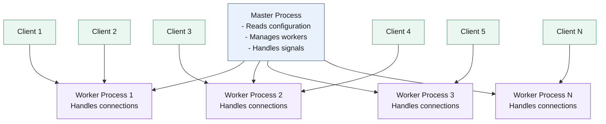
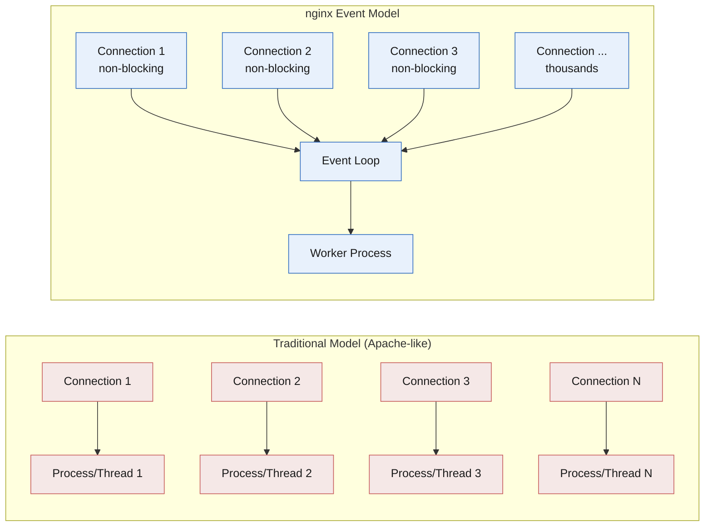
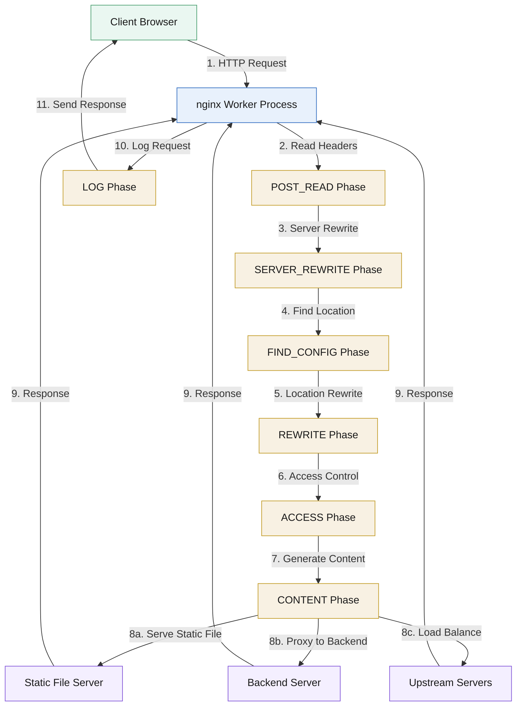
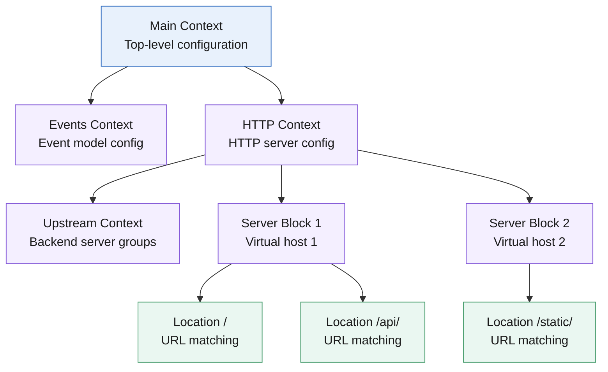

# nginx Architecture

## Process Model

nginx uses a master-worker process architecture:




### Master Process

Responsibilities:
- Reads and validates configuration
- Opens socket listeners (ports 80, 443, etc.)
- Starts, stops, and manages worker processes
- Handles signals (reload, stop, reopen logs)
- Does NOT process client requests

### Worker Processes

Responsibilities:
- Handle client connections
- Process HTTP requests
- Serve static files
- Proxy requests to backends
- Execute load balancing logic

Key characteristics:
- Each worker is independent
- Workers share socket listeners (SO_REUSEPORT)
- Workers don't share memory (except shared memory zones)
- One worker can handle thousands of connections

## Event-Driven Model

### Traditional Process Model (Apache-like)

```
Connection → New Process/Thread → Process Request → Close
```

Problems:
- High memory usage (each connection = separate process/thread)
- Context switching overhead
- Limited scalability

### nginx Event Model




Benefits:
- Single worker handles many connections
- Non-blocking I/O operations
- Efficient resource utilization
- High concurrency support

## Request Processing

### Request Lifecycle




The request goes through these steps:
1. **Client connects** to nginx
2. **Worker accepts** connection (using event mechanism)
3. **Reads request** headers
4. **Processes request** based on configuration:
   - Serve static file
   - Proxy to backend
   - Apply caching logic
   - Load balancing decision
5. **Sends response** to client
6. **Closes connection** (or keeps alive for HTTP/1.1)

### Phases of Request Processing

nginx processes requests in phases:

1. **POST_READ:** Read client request headers
2. **SERVER_REWRITE:** Server-level URL rewriting
3. **FIND_CONFIG:** Find matching location block
4. **REWRITE:** Location-level URL rewriting
5. **POST_REWRITE:** After rewriting
6. **PREACCESS:** Before access control
7. **ACCESS:** Access control checks
8. **POST_ACCESS:** After access control
9. **PRECONTENT:** Before content generation
10. **CONTENT:** Generate content (serve file, proxy, etc.)
11. **LOG:** Log request

## Configuration Contexts

nginx configuration is organized in hierarchical contexts:




Example structure:
```nginx
http {
    # HTTP-level directives
    
    upstream backend {
        # Upstream server definitions
    }
    
    server {
        # Server-level directives (virtual host)
        
        location / {
            # Location-level directives
        }
        
        location /api/ {
            # Another location block
        }
    }
}
```

### Context Types

- **Main:** Top-level configuration
- **Events:** Event model configuration
- **HTTP:** HTTP server configuration
- **Server:** Virtual host configuration
- **Location:** URL matching and processing
- **Upstream:** Backend server groups
- **Mail:** Mail proxy configuration (if enabled)
- **Stream:** TCP/UDP proxy configuration

## Connection Handling

### Connection Limits

- `worker_connections:` Maximum connections per worker
- Total connections = `worker_processes × worker_connections`

Example:
```nginx
worker_processes 4;
events {
    worker_connections 1024;
}
# Total: 4 × 1024 = 4096 connections
```

### Keep-Alive Connections

HTTP keep-alive allows multiple requests over a single connection:
- Reduces connection overhead
- Improves performance
- Controlled by `keepalive_timeout`

### Connection Queuing

When all workers are busy:
- New connections are queued
- Queue size: `listen` directive `backlog` parameter
- Default: Usually 511 connections

## Memory Management

### Memory Pools

nginx uses memory pools for efficient allocation:
- Allocations are grouped by request
- Entire pool freed when request completes
- Reduces memory fragmentation
- Fast allocation/deallocation

### Shared Memory

For data shared between workers:
- Cache zones
- Rate limiting zones
- Session storage
- Sticky sessions

## Performance Characteristics

### Why nginx is Fast

1. **Event-driven architecture:** Non-blocking I/O
2. **Efficient memory usage:** Memory pools, shared memory
3. **Optimized code:** Written in C
4. **Smart buffering:** Efficient data transfer
5. **Minimal context switching:** Single process per worker

### Typical Performance

- Can handle 10,000+ concurrent connections per worker
- Low memory usage: ~1-2 MB per 10,000 idle connections
- High throughput for static content
- Efficient reverse proxy performance

## Scalability

### Vertical Scaling

- Increase `worker_processes` (usually = CPU cores)
- Increase `worker_connections`
- Add more RAM

### Horizontal Scaling

- Run multiple nginx instances
- Use external load balancer
- DNS-based load balancing

## Security Architecture

### Process Isolation

- Workers run as unprivileged user
- Master process can run as root (for port binding)
- Workers dropped to non-root after startup

### Request Limits

- Connection limits per IP
- Request rate limiting
- Request size limits
- Timeout limits

## Next Steps

- Learn about [Configuration Basics](./03-configuration.md)
- Understand [Core Concepts](./04-concepts.md)
- Try [Demo 1: Serving Files](../01-serving-files/)
