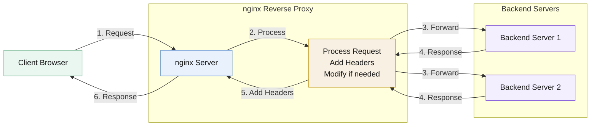
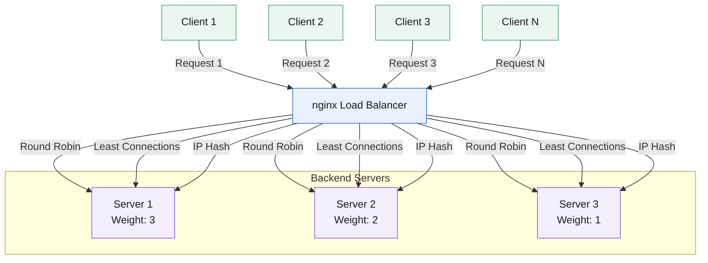
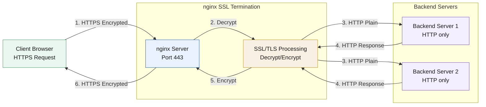
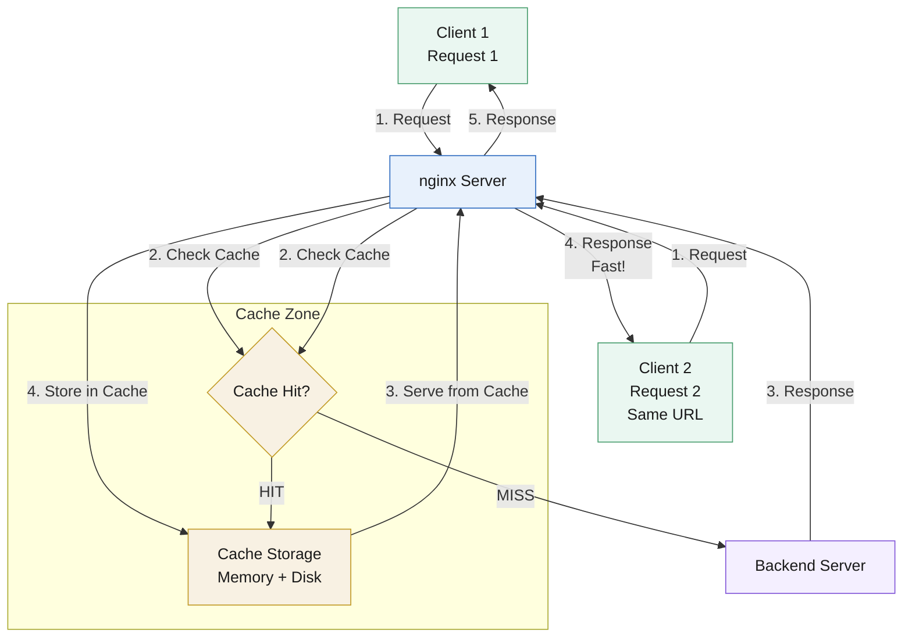
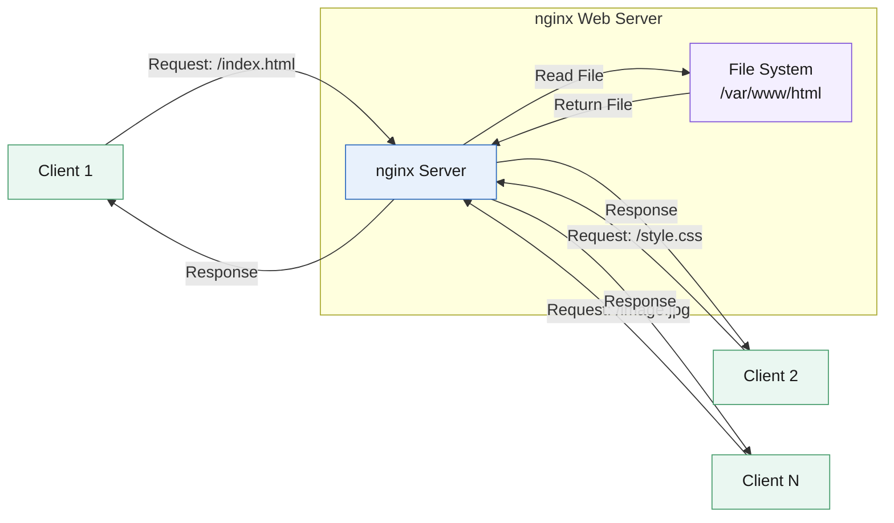

# Core nginx Concepts

## Reverse Proxy

### What is a Reverse Proxy?

A reverse proxy sits between clients and backend servers, forwarding client requests to appropriate backends and returning responses.

### Why Use a Reverse Proxy?

1. **Load Distribution:** Distribute requests across multiple servers
2. **SSL Termination:** Handle HTTPS at the proxy, not backend
3. **Caching:** Cache responses to reduce backend load
4. **Security:** Hide backend server details
5. **Single Entry Point:** Clients connect to one address
6. **Request/Response Manipulation:** Modify headers, rewrite URLs

### How It Works




nginx receives request, forwards to backend, receives response, sends to client.

## Load Balancing

### What is Load Balancing?

Distributing incoming requests across multiple backend servers to:
- Distribute load
- Improve availability
- Increase capacity
- Handle failures gracefully

### Load Balancing Methods




#### 1. Round Robin (Default)
Requests distributed evenly in order:
- Request 1 → Server 1
- Request 2 → Server 2
- Request 3 → Server 3
- Request 4 → Server 1 (cycle repeats)

#### 2. Least Connections
Route to server with fewest active connections:
- Server 1: 5 connections
- Server 2: 3 connections ← Next request goes here
- Server 3: 7 connections

#### 3. IP Hash
Same client IP always goes to same server:
- Client A (IP: 1.2.3.4) → Always Server 1
- Client B (IP: 5.6.7.8) → Always Server 2

#### 4. Weighted Round Robin
Servers receive requests proportional to weight:
- Server 1: weight=3 (handles 50% of requests)
- Server 2: weight=2 (handles 33% of requests)
- Server 3: weight=1 (handles 17% of requests)

### Health Checks

nginx can mark servers as down:
- Automatic detection of failed servers
- Temporary removal from rotation
- Automatic recovery when server comes back

## SSL/TLS Termination

### What is SSL Termination?

Processing SSL/TLS encryption/decryption at the proxy instead of backend servers.

### How It Works




### Benefits

1. **Offload Processing:** Backends don't handle SSL
2. **Centralized Management:** One place for certificates
3. **Performance:** nginx optimized for SSL
4. **Simplified Backends:** Backends can use HTTP

### Certificate Types

- **Self-signed:** For testing (browsers show warning)
- **CA-signed:** From trusted Certificate Authority
- **Let's Encrypt:** Free, automated certificates

## Caching

### What is Caching?

Storing responses temporarily to serve future identical requests faster without hitting backend.

### Cache Benefits

1. **Performance:** Faster response times
2. **Reduced Load:** Less backend processing
3. **Bandwidth:** Lower bandwidth usage
4. **Availability:** Serve stale content if backend down

### How nginx Caching Works




- Request 1: Client → nginx → Backend → Response (stored in cache)
- Request 2: Client → nginx → Cache (served directly, no backend call)

### Cache Zones

Defined storage areas for cached content:
- Memory zone for metadata
- Disk storage for actual content
- Configurable size and cleanup policies

### Cache Keys

Determine what makes responses unique:
- Default: Scheme + Method + Host + URI
- Can include headers, cookies, etc.
- Same key = same cached response

### Cache Status

- **MISS:** Not in cache, fetched from backend
- **HIT:** Served from cache
- **BYPASS:** Cache intentionally skipped
- **EXPIRED:** Cache entry expired, fetching fresh
- **STALE:** Serving old content (backend unavailable)

## Static File Serving

### What is Static File Serving?




Directly serving files (HTML, CSS, JS, images) without processing.

### Why nginx for Static Files?

1. **Performance:** Highly optimized for file serving
2. **Efficiency:** Low memory usage
3. **Concurrency:** Handles many simultaneous requests
4. **Features:** Range requests, gzip, cache control

### Common Use Cases

- Web frontend files
- API documentation
- Downloadable files
- Media files (images, videos)

## Location Matching

### Understanding Location Blocks

Location blocks determine how different URLs are processed:

```nginx
location / {
    # Matches all requests
}

location /api/ {
    # Matches /api/ and anything under it
}

location = /exact {
    # Only matches exactly /exact
}

location ~ \.php$ {
    # Regex: matches URLs ending in .php
}
```

### Matching Priority

1. Exact match (`=`) - Highest priority
2. Longest prefix match
3. Regex matches (first match wins)
4. Generic prefix (`/`) - Lowest priority

## Upstream Servers

### What are Upstream Servers?

Groups of backend servers that nginx can proxy to or load balance across.

### Configuration

```nginx
upstream backend {
    server 127.0.0.1:8001;
    server 127.0.0.1:8002;
    server 127.0.0.1:8003;
}

location / {
    proxy_pass http://backend;
}
```

### Server Options

- **Weight:** `server 127.0.0.1:8001 weight=3;`
- **Backup:** `server 127.0.0.1:8001 backup;`
- **Down:** `server 127.0.0.1:8001 down;`
- **Max Fails:** `server 127.0.0.1:8001 max_fails=3;`

## HTTP Headers

### Important Headers

nginx can set and modify headers:

- **Host:** Original host header for backend
- **X-Real-IP:** Client's real IP address
- **X-Forwarded-For:** Chain of proxy IPs
- **X-Forwarded-Proto:** Original protocol (http/https)
- **Cache-Control:** Cache behavior directives

### Security Headers

Common security headers to set:

- **Strict-Transport-Security:** Force HTTPS
- **X-Frame-Options:** Prevent clickjacking
- **X-Content-Type-Options:** Prevent MIME sniffing
- **X-XSS-Protection:** Enable XSS filter

## Request Processing

### Request Flow

1. Client sends HTTP request
2. nginx receives request
3. Determines server block (virtual host)
4. Matches location block
5. Executes location directives
6. Serves response or proxies to backend
7. Returns response to client

### Common Processing Steps

1. **Authentication:** Check access permissions
2. **Rate Limiting:** Enforce request limits
3. **Rewrite:** Modify URLs if needed
4. **Proxy/Cache:** Forward or serve from cache
5. **Logging:** Record request details
6. **Response:** Send response to client

## Performance Optimization

### Key Optimization Areas

1. **Worker Processes:** Match CPU cores
2. **Worker Connections:** Balance memory and concurrency
3. **Caching:** Reduce backend load
4. **Compression:** Reduce bandwidth (gzip)
5. **Keep-Alive:** Reuse connections
6. **Sendfile:** Efficient file transfer

### Monitoring

Important metrics:
- Request rate
- Response times
- Error rates
- Cache hit rates
- Active connections
- Worker process status

## Security Considerations

### Basic Security Practices

1. **Keep nginx Updated:** Latest security patches
2. **Minimal Configuration:** Only enable needed features
3. **Access Control:** Restrict access where possible
4. **SSL/TLS:** Use HTTPS in production
5. **Security Headers:** Add protective headers
6. **Rate Limiting:** Prevent abuse
7. **Hide Version:** Don't expose nginx version

### Common Vulnerabilities

- Missing security headers
- Exposed sensitive files
- Weak SSL configuration
- Insufficient rate limiting
- Directory traversal issues

## Next Steps

Now that you understand the core concepts, try the hands-on demonstrations:

1. [Demo 1: Serving Files](../01-serving-files/)
2. [Demo 2: Reverse Proxy](../02-reverse-proxy/)
3. [Demo 3: Load Balancer](../03-load-balancer/)
4. [Demo 4: SSL Termination](../04-ssl-termination/)
5. [Demo 5: Caching](../05-caching/)
6. [Demo 6: Docker Compose](../06-docker-compose/)
